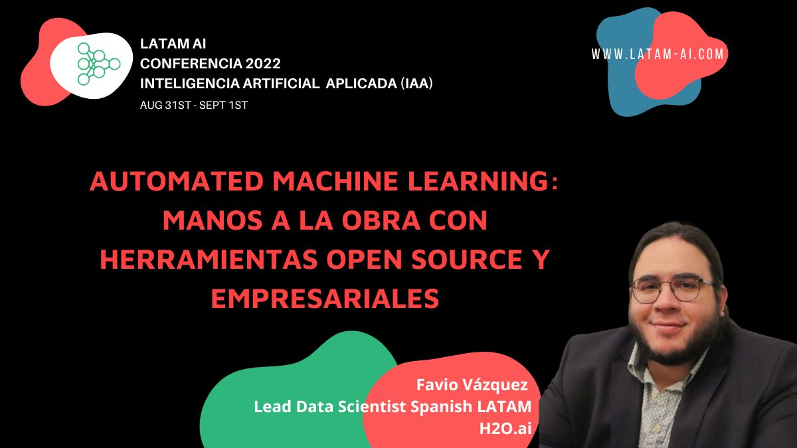

# Workshop: Automated Machine Learning
## Favio Vázquez

Workshop AutoML en la conferencia Inteligencia 
Artificial Aplicada de LATAM-AI

## Agenda

- Introducción al machine learning (y sus complicaciones)
- Encendiendo el piloto automático: AutoML
- Panorama actual del AutoML
- Principales librerías Open-Source
- Principales productos empresariales
- Taller Pt. 1: Librerías Open-Source
- Taller Pt. 2: H2O AI Driverless AI

## Notebooks

- [Machine learning básico](https://github.com/FavioVazquez/automl-workshop-2022/blob/main/ML_Basic.ipynb)
- [Machine learning avanzado](https://github.com/FavioVazquez/automl-workshop-2022/blob/main/ML_Advanced_NoAutoML.ipynb)
- [AutoML con H2O-3](https://github.com/FavioVazquez/automl-workshop-2022/blob/main/H2O_AutoML.ipynb)
- [AutoML con FLAML](https://github.com/FavioVazquez/automl-workshop-2022/blob/main/FLAML.ipynb)
- [AutoML con Auto-Keras]()
- [AutoML con TPOP](https://github.com/FavioVazquez/automl-workshop-2022/blob/main/TPOT.ipynb)
- [AutoML con PyCaret]()

## Slides

- Coming soon
